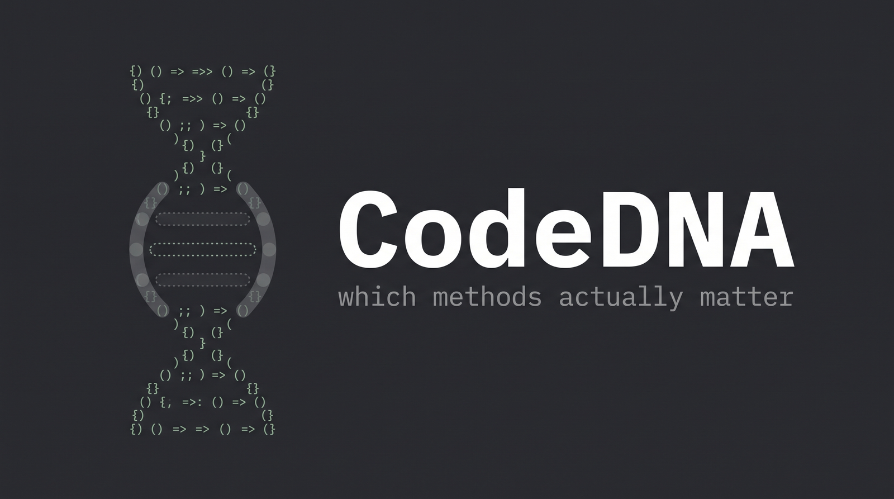

# CodeDNA

[English](README.md) · **Português**

**Quais partes de um programa realmente sustentam ele?**

CodeDNA responde isso com um experimento emprestado da genética: desliga um gene, observa o
organismo, devolve o gene, repete. Aqui o organismo é um programa Java e os genes são seus métodos.

```
código-fonte -> executa -> remove um método -> executa de novo -> compara -> essencialidade
```

O analisador inteiro é um arquivo, ~120 linhas, zero dependências.

## O problema

Cobertura diz quais linhas *rodaram*. Métricas de complexidade dizem quais linhas são *difíceis de
ler*. Nenhuma das duas responde o que você quer saber ao abrir um código desconhecido:

> Se este método sumisse amanhã, alguém notaria?

Essa pergunta normalmente é respondida apagando coisas e vendo o que quebra — o que ninguém faz,
porque é tedioso e destrutivo. CodeDNA faz exatamente isso, automaticamente, numa cópia.

## O conceito

Geneticistas descobrem para que serve um gene desativando ele e observando o organismo resultante.
Um *knockout* que mata o organismo marca um gene essencial. Um knockout que ninguém percebe marca um
passageiro.

CodeDNA aplica o mesmo protocolo a código. Ele esvazia um corpo de método por vez — mantendo a
assinatura, então tudo ainda compila —, recompila o programa, roda de novo e mede quanto do
comportamento original sobreviveu.

**Essencialidade = a fração do comportamento observável do programa que desaparece quando o método é
removido.**

Sem anotação, sem framework de teste, sem arquivo de configuração. Ele lê um `.java` e reporta.

## Como funciona

1. Roda o programa intacto e guarda a saída. Esse é o fenótipo saudável.
2. Encontra cada método por profundidade de chaves e, para cada um, produz uma variante do código em
   que aquele corpo vira `return 0;` / `return null;` / nada, conforme o tipo de retorno.
3. Compila e roda cada variante num classloader isolado, capturando a saída.
4. Compara com a saída saudável, linha a linha. Linha que não aparece mais é comportamento perdido.
   Variante que quebra ou nem compila pontua 100% — o organismo não é viável.
5. Desenha o resultado como gráfico de barras.

É o programa inteiro. Quem compila é o `javax.tools.JavaCompiler` — o compilador que já vem dentro de
todo JDK —, então não há build system nem nada para instalar.

## Exemplo

```java
public class Demo {
    static int[] parse(String order)              { ... }
    static boolean valid(int[] item)              { ... }
    static int total(int[] item)                  { ... }
    static String format(int[] item, int total)   { ... }
    static void log(String message)               { ... }
    static void debug(String message)             { ... }

    public static void main(String[] args)        { ... }
}
```

```bash
javac -d build src/CodeDNA.java
java -cp build CodeDNA examples/Demo.java
```

## Resultado

```
CODE DNA

parse()   ██████████ 100%
valid()   ███████     67%
total()   ███████     67%
format()  ██████      56%
log()     ██          22%
debug()   █           11%
```

Lendo de cima: sem `parse()` o programa não sobrevive. `valid()` e `total()` pesam igual — tire
qualquer um dos dois e dois terços da saída mudam. `format()` só afeta como o resultado é impresso,
não se ele está certo. `log()` e `debug()` são passageiros: o programa calcula exatamente as mesmas
respostas sem eles.

Ninguém escreveu teste, assertion ou anotação para chegar nisso. Saiu do arquivo-fonte sozinho.

O [`notebook/CodeDNA.ipynb`](notebook/CodeDNA.ipynb) roda a mesma análise e plota o gráfico.

## Requisitos

Um JDK 17 ou mais novo — só isso. O notebook usa `matplotlib` a mais, para o gráfico.

## Limitações atuais

Fronteiras honestas do MVP, não um roadmap disfarçado:

- **Um arquivo, um ponto de entrada.** O alvo precisa ser um único `.java` com `main`.
- **Comportamento significa stdout.** Valor de retorno, arquivo e efeito colateral são invisíveis
  para o oráculo. Método que só muda estado e não imprime nada pontua 0%.
- **Método falante parece importante.** A essencialidade é medida contra a saída impressa, então um
  logger que imprime metade das linhas é lido como metade do comportamento. Julgar contra assertions
  em vez de saída resolveria isso.
- **A cobertura limita o veredito.** Método que aquela execução nunca alcança pontua 0%, importe ele
  ou não em outro caminho.
- **O parser é um contador de chaves.** Chave dentro de string literal ou comentário confunde ele.
- **Os mutantes rodam no mesmo processo.** Laço infinito trava a análise e `System.exit` encerra ela.

## Caminhos possíveis

- **Usar uma suíte de testes como oráculo** no lugar do stdout — a essencialidade vira "porcentagem
  de testes que falham", o que elimina o viés do logger falante.
- **Knockout duplo.** A genética chama isso de epistasia: `A` só importa quando `B` some? Knockouts
  em par exporiam caminhos redundantes e fallbacks silenciosos.
- **Outras linguagens.** Nada aqui é específico de Java, exceto a chamada ao compilador. Qualquer
  linguagem com um passo de "compilar" e um de "rodar" cabe no mesmo protocolo.
- **DNA como artefato.** Emitir o perfil em JSON e comparar entre commits, para ver a essencialidade
  se deslocar conforme o código evolui.

## Licença

MIT
